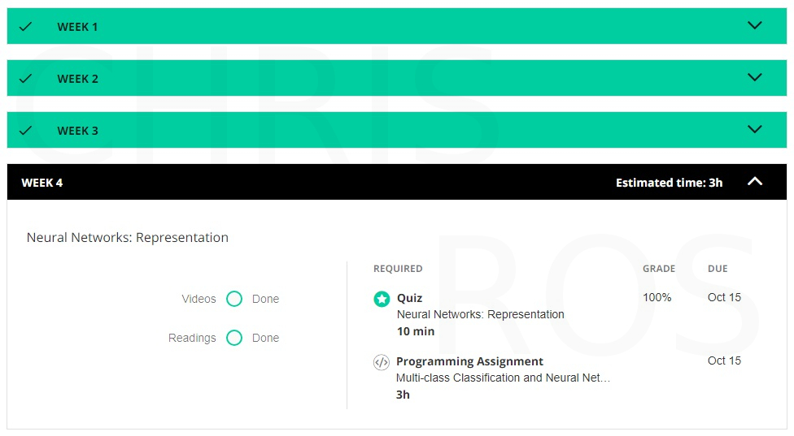
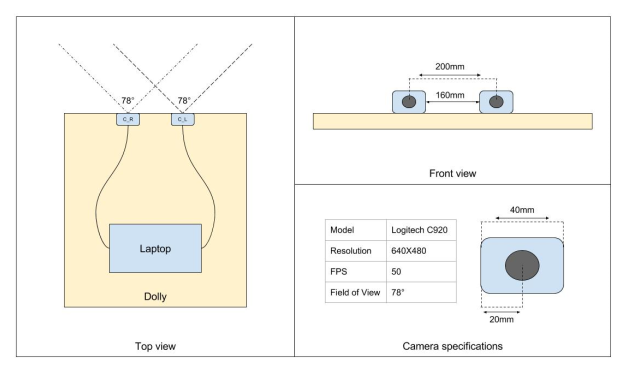
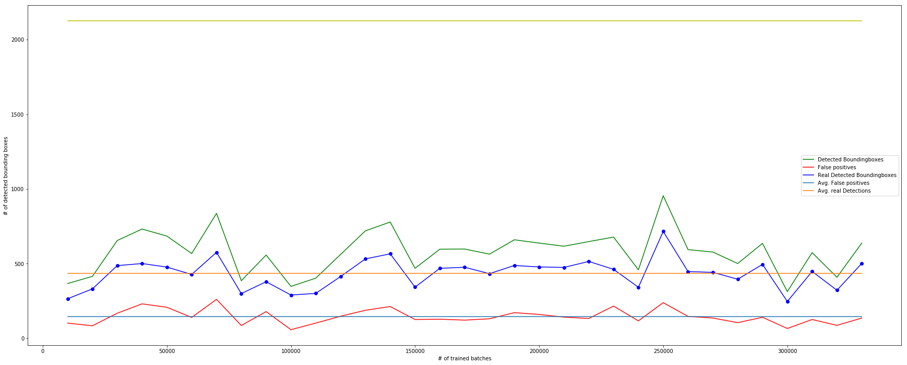
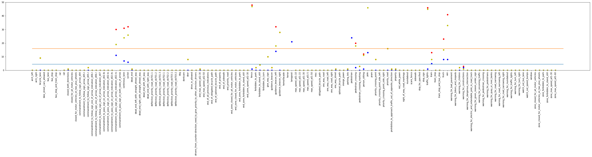

<head>
 <link rel="shortcut icon" type="image/x-icon" href="favicon.ico">
</head>

# Welkom!
Op mijn Github-Pages site ter behoeve van het vastleggen van mijn portfolio.
Ik zal deze site gedurende de loop van het blok KB-74: Applied data science, opbouwen.
Dit portfolio zal dienen als een naslagwerk van mijn uitgevoerde werkzaamheden gedurende 'KB-74',
waar ik deel heb uitgemaakt van het project *Urbinn*.

## Urbinn?
URBINN, afkorting van URBan INNovations is een LearningLab rondom autonoom rijdend vervoer binnen stedelijke gebieden.
Binnen URBINN wordt een autonoom rijdend voertuig ontwikkeld dat als basis zal dienen voor onderzoek naar autonoom rijde en de toepassing daarvan binnen een stedelijk gebied. De ontwikkeling hiervan is opgedeeld in meerdere minoren:
* **Applied data science**
* Embedded systems
* Living labs
* Research and innovation
* Robotics and vision design
* Serious gaming

Alle bovengenoemde minoren vallen  onder het Lectoraat Smart Sensor Systems. De ontwikkeling van het voertuig wordt geheel gecoördineerd en gefaciliteerd binnen de Betafactory, te Delft.

## Wat valt er te vinden in dit portfolio?
De volgende items zullen in ieder geval naar voren komen in mijn portfolio:
* De door mij gegeven presentaties
* Code snippets die ik geschreven heb
* Screenshots van de online courses die ik doorlopen heb. (DataCamp / Coursera)
* De tickets die ik opgelost heb.
* Uitgelichte onderwerpen
* De opdrachten van de bezochte workshops

Verder zal dit lijstje aangevuld worden met:
opgeleverde producten, eigen experimenten, testen, producten, etc.

## Hoe ga ik dit doen?
Vanwege de incrementele aard van dit portfolio en het overzicht wat daarbij ge*paard* gaat, heb ik ervoor gekozen om per week het portfolio aan te vullen.
Ik zal hierbij aan het einde van de week de belangrijkste gebeurtenissen verzamelen en documenteren en onder het kopje van die week in mijn portfolio stoppen

***

# Het portfolio

***
## Behandelde issues:
###### Te vinden op [GitHub issues](https://github.com/urbinn/urbinn/issues?q=assignee%3Achrisros) voor  toegang graag contact opnemen met @jeroenvuurens.
id  | Beschrijving
--- | -----------------------------------------------------------------------------------
 2  | Het zoeken van bestaande datasets, zoals videobeelden en kaarten verzameld door andere partijen (organisaties/universiteiten) Het in kaart brengen van gebruikte technologieën zoals camera’s, sensoren & tooling.
 22 | Deze week hebben we verschillende projecten met eigen algoritmes (vertakkingen van SLAM (Simultaneous Localisation and Mapping) onderzocht. Criteria opgesteld waar de algortimes aan moeten voldoen. Mogelijke kandidaten geselecteerd waar wij verder mee gaan experimenteren. Uiteindelijke kandidaten: ORB-SLAM2 & SVO.
 31 | Glossary aangemaakt voor het centraal beheren van alle begrippen en hun betekenis.
 34 | Samen met jeroen heb ik gezocht naar de juiste camera voor het het gebruik met stereo-SLAM, uitgekomen op de ZED van stereolabs
 35 | Ik heb de camera calibratie binnen ROS werkend gemaakt, dit maakt het mogelijk elke (stereo) camera te calibreren.
 38 | Zelf een testopstelling gemaakt met twee webcams om als stereo camera footage te gebruiken, zie meer bij 'Stereo camera hack'.
 44 | Geholpen met de installatie van ORB2 SLAM op de datascience server.
 53 | ORB2 installatie in een eigen repository gestopt.
 55 | Onderzoek gedaan naar object detection papers.
 59 | Documenteren van de data structuur van 'Map' binnen ORB2
 65 | Yolo uitproberen op KITTI, Uit veel papers blijkt echter wel dat YOLO een van de beste kandidaten is op het gebied van real-time object detection en classification. Na een korte orientatie legde ik de focus op 2 kandidaten: Tiny-YOLO && YOLO9000. Na enige tests kwam ik tot de conclussie dat de accuraatheid van beide smaakjes voor ons doeleinde voldoende is. Omdat Tiny-YOLO veel 'lichter' is ligt de verdere focus op Tiny-YOLO. Ook is uit onderzoek gebleken dat op vierkante afbeeldingen de detectie veel beter en sneller verloopt, dus heb ik de afbeeldngen ook opgeknipt in vierkantjes. De resultaten van de tests zijn te vinden in de map [testcases_yolo](testcases_yolo/).
 73 | Ik heb mij bezig gehouden met het bulk inladen van images in de tiny yolo omgeving. Ik heb hierbij gebruik gemaakt van de bestaande hooks uit darknet.py. Hierdoor heb ik door middel van een [python script](scripts/Run_yolo.md) interactie met de C++ core van YOLO en is het mogelijk eenvoudig een bulk afbeeldingen te verwerken. Tevens heb ik een uitbreding gemaakt die zelf de zogenaamde 'bounding boxes' om de herkende objecten heen tekent.
 74 | Van de dataset van ticket #73 is een Zogenaamde 'ground truth' bekend, dit zijn afbeeldingen die door mensen voorzien zijn van labels op de plaatsen waar objecten staan om de grote dataset van kitte 7000+ foto's te controlleren heb ik een [python script](scripts/Validation_IOU_kitti.md)  geschreven die op basis van de Intersection Over Union de false positives van TinyYolo bepaald. De uitkomst was 0.14% false positives met een IOU van >50%
 76 | [Repository](https://github.com/urbinn/yolo) ingericht met daarin YOLO zodat dit eenvoudig uitgerold kan worden.
 83 | Klassen vastgesteld welke we in onze eigen trainings dataset willen hebben, zodat we YOLO kunnen trainen op het herkennen van deze klassen
 90 | Samen met Nektarios met de nieuwe ZED Stereocamera beelden geschoten in slinger zodat deze gebruikt kunnen worden voor het evalueren van ORB SLAM
 92 | Calibratie uitgevoerd van de nieuwe camera
 93 | Samen met Jeroen en Kevin gewerkt aan een werkende training configuratie van Darknet en YOLO dit om te kijken of we zelf een yolo instantie konden trainen, dit bleek moeilijk maar succesvol
 96 | Om de oorzaak van problemen met de locatie van de getekende boundingboxes te achterhalen heb ik de output van  alle daarme in aaraking komende scripts gevalideerd.
 97 | Met het script uit ticket 74 heb ik de output van yolo welke gedraaid heeft op door onzelf getrainde weights gevalideerd.
 98 | Samen met Kevin en Nektarios de configuratie files van yolo beschreven om zo meer kennis en begrip op te doen met YOLO. Tevens was dit voorbereiding op het trainen van ons eigen model
116 | Evalutatie van de training van YOLO, later overschaduwd door #117
117 | Evalutatie van de training van YOLO per batch, dit was door Jeroen gevraagd om inzicht te krijgen in de benodigde trainingsduur voor een proof-of-concept model, uitgewerk onder de kop 'Evaluatie zelf getrainde YOLO '
127 | LAng bezig geweest met het uitzoeken waarom labels niet aan de juiste klassen werden toegekend op de LIACS server, na her-installatie op datascience server werkte alles weer.
133 | Samen met Viradj met de ZED camera stereo-opnames gemaakt in Delft.

## Presentaties:
###### Te vinden in [presenaties](presentaties/)
 Presentatie  | Beschrijving
------------- | -----------------------------------------------------------------------------------
[Week 1](presentaties/week_1.pdf) | Ik heb samen met Nektarios de presentatie van deze week voorbereid en uitgevoerd.
[Week 2](presentaties/week_2.pdf) | Ik heb samen met Nektarios de presentatie van deze week voorbereid en uitgevoerd.
[Week 4](presentaties/week_4.pdf) | In verband met ziekte heb ik samen met Kevin de presentatie van deze week uitgevoerd.
[Week 5](presentaties/week_5.pdf) | In verband met ziekte heb ik samen met Daniello de presentatie van deze week uitgevoerd.
[Week 18](presentaties/week_18.pdf) | In verband met afwezigheid heb ik samen met Jeffrey de presentatie van deze week uitgevoerd.
[Week 19](presentaties/week_19.pdf) | Ik heb samen met Jeffrey het paper gepresenteerd t.b.v. feedback.

## Notebook scripts:
###### Te vinden in [scripts](scripts/)
Script    | Beschrijving
------------- | -----------------------------------------------------------------------------------
[Run_yolo.py](scripts/Run_yolo.md) | Python script die door middel van hooks in yolo/darknet reeksen foto's verwerken automatiseert
[Validation_IOU_kitti.py](scripts/Validation_IOU_kitti.md) | Python script die de output van yolo kan valideren tegen de Groundtruth van de Kitti dataset, hij doet dit op basis van Intersection Over Union (IOU)
[bbox_to_yolo.py](scripts/bbox_to_yolo.md) | Python script die de output van de bbox tool omzet naar Yolo labels, tevens te vinden in de [BBox-Label-Tool](https://github.com/urbinn/BBox-Label-Tool) Repository.

## Repositories:
###### verschillende Repositories van [Urbinn](https://github.com/urbinn/) waaraan ik heb bijgedragen. Voor toegang graag contact opnemen met @jeroenvuurens.
  Repository  | Beschrijving
------------- | -----------------------------------------------------------------------------------
[BBox-Label-Tool](https://github.com/urbinn/BBox-Label-Tool) | Bestaande label tool welke door mij en Nektarios aangepast is om meerdere klasses te kunnen verwerken. Tevens zijn er meerdre bugfixes uitgevoerd en is de gebruiksvriendelijkheid verbeterd.
[Tiny-YOLO](https://github.com/urbinn/yolo/) | Eigen fork van het YOLO project op basis van darknet.

## Handelingsdelen
###### Tijdens deze minor waren er enkele verplichte handelingsdelen, hieronder de resultaten

### Coursera 'machine learning' :
Tijdens de minor heb ik de benodigde delen van de coursera cursus 'machine learning' afgerond, hieronder de resultaten.

### Datacamp:
Vanwege mijn afdoende kennis m.b.t. Python 3.4+ en bijbehorende libaries heb ik deze cursus overgeslagen. Wel zijn stukken van mijn python code terug te vinden in de map [scripts](scripts/).

### Calling Bullsh\*t (in data science):
Voor de minor hebben we de cursus "Calling bullsh\*t" gevolgd. hiervoor moesten we een [opdracht](docs/calling_bullshit.pdf) maken. Het doel hiervan was verschillende soorten bullshit te verzamelen en te documentren.

### Spark:
Tijdens de minor heb ik een cursus Spark afgerond. Deze cursus bestond uit twee delen, klik hier voor [deel 1](Spark/assignment_1.ipynb) of [deel 2](Spark/assignment_2.ipynb).

### Exploratory data science:
Tijdens de minor heb ik een cursus Exploratory data science afgerond. Deze cursus bestond uit negen delen, [klik hier voor een overzicht van de opdrachten](Exploratory_data_analysis/).

## Uitgelichte onderwerpen:

### Stereo camera hack:
In week ben 4 ik vooral bezig geweest met het maken van en setup voorzien van 2 losse webcams, welke door middel van ROS (Robot Operating System) i.s.m. usb_cam stereo beelden konden opnemen (te zien in de onderstaande afbeelding). Hoewel het experiment redelijk geslaagd was, was het niet mogelijk deze beelden om te zetten in een accurate pointcloud in ORB-slam. Desalniettemin een leuke en vooral leerzame uitstap in het project

### Testen YOLO varianten:
De YOLO software is zeer slecht gedocumenteerd, uit veel papers blijkt echter wel dat YOLO een van de beste kandidaten is op het gebied van real-time object detection en classification. Na een korte orientatie legde ik de focus op 2 kandidaten: Tiny-YOLO && YOLO9000.
Na enige tests kwam ik tot de conclussie dat de accuraatheid van beide smaakjes voor ons doeleinde voldoende is. De resultaten van de tests zijn te vinden in de map [testcases_yolo](testcases_yolo/). De gebruikte kandidaat per foto is te herkennen aan de `*_9000` of `*_tiny` in het einde van de naam.
Omdat Tiny-YOLO veel 'lichter' is ligt de verdere focus op Tiny-YOLO.
Ook is uit onderzoek gebleken dat op vierkante afbeeldingen de detectie veel beter en sneller verloopt. re resultation hiervan zijn te zien in de mappen [110](testcases_yolo/0000000110/) & [010](testcases_yolo/0000000010/), waarbij afbeeldingen 1 t/m 4 vierkant overlappende afbeeldingen van links naar rechts zijn. deze zijn samengevoegd in een afbeelding te herkennen aan `*_collage` in het einde van de naam.
De resultaten van alle tests zijn te vinden in de map [testcases_yolo](testcases_yolo/).

### Sequence van afbeeldingen, uitvoer van TinyYOLO:
Ik heb mij bezig gehouden met het bulk inladen van images in de tiny yolo omgeving. Ik heb hierbij gebruik gemaakt van de bestaande hooks uit darknet.py. Hierdoor heb ik door middel van een python script interactie met de C++ core van YOLO en is het mogelijk eenvoudig een bulk afbeeldingen te verwerken. Tevens heb ik een uitbreding gemaakt die zelf de zogenaamde 'bounding boxes' om de herkende objecten heen tekent, tevens wordt deze informatie plain text in een JSON opgeslagen.
Hieronder staat een geanimeerde afbeelding van een reeks van 200 achtereenvolgende foto's welke zij bewerkt door middel van mijn script.

### Evaluatie zelf getrainde YOLO 
Voordat we konden valideren moest er eerst getrained worden.
In overleg met de hele groep hebben we 133 klassen gekozen die we willen kunnen herkennen
Door enkele groepsgenoten zijn uit de dataset van KITTI in +-1700 afbeeldingen objecten voorzien van een omtrek (BoundingBox) en een label, corresponderend aan een van de 133 klassen. Deze deze labels zijn aangebracht met de zelf aangepaste BBOX-labeling-tool. De labels die hieruit kwamen zijn met het [convert.py script](scripts/convert.py) voor YOLO geformateerd. De dataset was nu klaar voor training.

 - Yolo training op datascience server gestart d.m.v. een [bash script](scripts/train_ownlabels):
 - Dit script maakt gebruik van de config files uit de volgende map:
   `datascience.hhs.nl:/data/urbinn/darknet/own_cfg/`
 - De output van de training (de weights, opgeslagen per 10.000 verwerkte batches) zijn te vinden in: 
   `datascience.hhs.nl:/data/urbinn/darknet/kitti_own_labels_0612/`
 - Deze weights zijn gebruikt als input voor het ['batch_validate' script](scripts/batch_validate.py). Dit script draaide een validatie run voor elke weights file in
    `datascience.hhs.nl:/data/urbinn/darknet/kitti_own_labels_0612` 
 - En creerde daarvoor een map met corresponderende naam in:
    `datascience.hhs.nl:/data/urbinn/darknet/output/batch/`
 - Elk van deze mappen bevat een 'objects.json'  met daarin per foto de herkende objecten, deze zijn gebruikt als input van [mijn notebook](scripts/Validation_IOU_Batch.md). Dit notebook haalt per 'foto' in objects.json de herkende bounding-boxes op en vergelijkt deze met de gegevens uit de met de hand gelabelde ground truth, te vinden in:
    `datascience.hhs.nl:/data/urbinn/darknet/gtconverted/`
    
    
Om het zelfgetrainde model te evalueren heb ik enkele visualisaties gemaakt.
de eerste visualisatie laat de de succesvol herkende objecten gezien voor elke weight file. Hieruit val op te maken dat je maar 30/40 duizend batches nodig hebt om een model ver genoeg te trainen om te kijken of het de goede kant op gaat.

Uit eerdere studies bleek dat het vaak enkele klassen zijn die niet voldoende herkend worden, deze hebben dan meer trainingsmateriaal nodig. Om dit te visualieren heb ik van batch 250.000 de detectie per klasse laten plotten:

